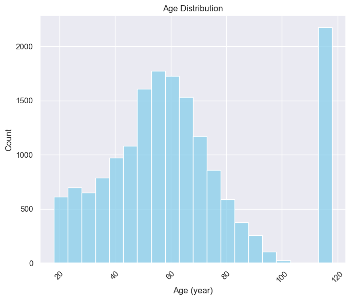
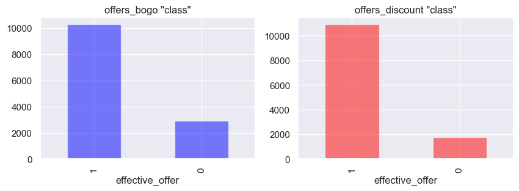
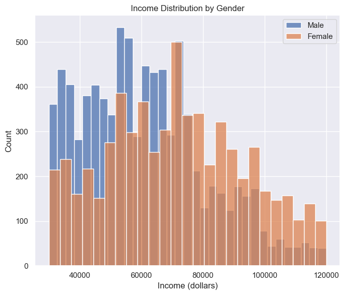

## Table of Contents
- [Summary](#summary)
- [The Task](#the-task)
- [Dependencies](#dependencies)
- [Installing](#installing)
- [Executing Program](#executing-program)
- [File Descriptions](#file-descriptions)
- [Screenshots](#screenshots)

## Summary
This data set contains simulated data that mimics customer behavior on the Starbucks rewards mobile app. Once every few days, Starbucks sends out an offer to users of the mobile app. An offer can be merely an advertisement for a drink or an actual offer such as a discount or BOGO (buy one get one free). Some users might not receive any offer during certain weeks. 


## The Task
- Combine transaction, demographic and offer data 
- Build a machine learning 'model' that can determine which demographic groups respond best to which offer type.

## Getting Started
1. run Piplines/ETL Pipeline Preparation.ipynb and will make ETL_Preparation.db file


## Dependencies
requirements.txt

- pandas
- matplotlib
- seaborn
- numpy
- scipy
- scikit-learn
- tensorflow
- keras

## Installing

- Create a new 'virtual environment' (conda or venv) 
- Activate the new environment
- and install the dependencies.

```
python -m venv myenv

# for windows
myenv\Scripts\activate.bat

# for linux and macOS
source myenv/bin/activate

pip install -r requirements.txt
```

## Executing Program
Run the capstone4.ipynb file


## File Descriptions
- data
  - portfolio.json - containing offer ids and meta data about each offer (duration, type, etc.)
  - profile.json - demographic data for each customer
  - transcript.json - records for transactions, offers received, offers viewed, and offers completed


- capstone4.ipynb - main file
- requirements.txt - dependencies
- screenshots - screenshots of the results
- capstone_report.pdf - report of the project


## Screenshots





